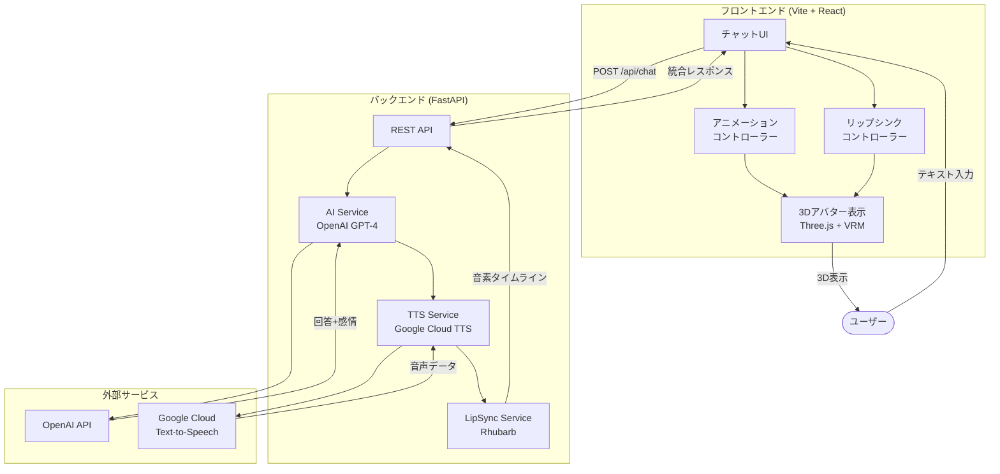
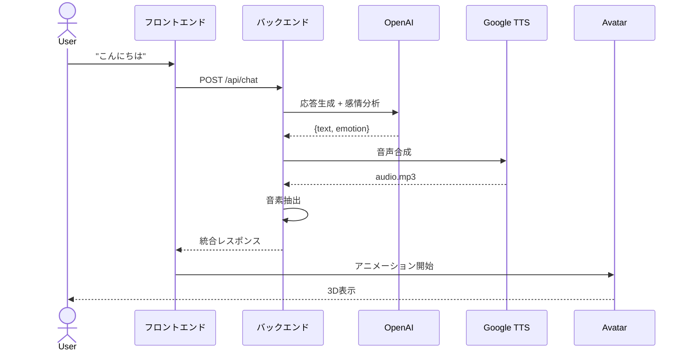

# 02. システム構成

[[01-プロジェクト概要|← 前へ]] | [[00-INDEX|目次]] | [[03-技術スタック|次へ →]]

---

## 2.1 システム全体構成図



## 2.2 アーキテクチャ概要

### レイヤー構成

```
┌─────────────────────────────────┐
│   プレゼンテーション層           │
│   - React Components            │
│   - Three.js Canvas             │
└─────────────────────────────────┘
           ↓ ↑
┌─────────────────────────────────┐
│   アプリケーション層             │
│   - Animation Controllers       │
│   - State Management            │
└─────────────────────────────────┘
           ↓ ↑
┌─────────────────────────────────┐
│   API層                         │
│   - REST API (FastAPI)          │
└─────────────────────────────────┘
           ↓ ↑
┌─────────────────────────────────┐
│   サービス層                     │
│   - AI Service                  │
│   - TTS Service                 │
│   - LipSync Service             │
└─────────────────────────────────┘
           ↓ ↑
┌─────────────────────────────────┐
│   外部サービス層                 │
│   - OpenAI API                  │
│   - Google Cloud TTS            │
└─────────────────────────────────┘
```

## 2.3 コンポーネント詳細

### フロントエンド構成

| コンポーネント | 責務 | 関連ページ |
|---------------|------|-----------|
| ChatUI | ユーザー入力・メッセージ表示 | [[07-UI-UX要件]] |
| AvatarCanvas | 3Dアバターのレンダリング | [[04-アバター表示機能]] |
| AnimationController | アニメーション制御・優先度管理 | [[05-アニメーション機能#アニメーション階層構造]] |
| LipSyncController | 口パクの制御 | [[05-アニメーション機能#リップシンク]] |
| EmotionController | 表情制御 | [[05-アニメーション機能#表情制御]] |
| IdleMotionController | 待機時モーション管理 | [[05-アニメーション機能#アイドルモーション]] |

### バックエンド構成

| サービス | 責務 | 使用技術 |
|---------|------|---------|
| AI Service | 応答生成・感情分析 | OpenAI GPT-4 |
| TTS Service | 音声合成 | Google Cloud TTS |
| LipSync Service | 音素抽出 | Rhubarb Lip Sync |

詳細は [[10-API仕様|API仕様]]を参照

## 2.4 データフロー

### 基本対話フロー



詳細は [[06-AI対話機能#対話処理フロー|AI対話機能]]を参照

## 2.5 通信仕様

### プロトコル
- **HTTP/HTTPS**: REST API通信
- **WebSocket**: 将来の拡張用（Phase 2以降）

### エンドポイント
```
POST /api/chat      - チャット応答
GET  /api/health    - ヘルスチェック
```

詳細は [[10-API仕様|API仕様]]を参照

## 2.6 セキュリティ設計

### 認証・認可
Phase 1では未実装（Phase 2で追加予定）

### データ保護
```
- API キーは環境変数で管理
- HTTPS通信必須
- CORS設定適切に
- XSS対策実施
- 入力サニタイズ
```

詳細は [[08-非機能要件#セキュリティ|非機能要件]]を参照

## 2.7 関連ドキュメント

- [[03-技術スタック|技術スタック]] - 使用技術の詳細
- [[10-API仕様|API仕様]] - API詳細仕様
- [[11-ファイル構成|ファイル構成]] - プロジェクト構造
- [[14-デプロイメント|デプロイメント]] - 本番環境構成

---

**タグ**: #アーキテクチャ #システム構成 #データフロー
**更新日**: 2025-10-30
