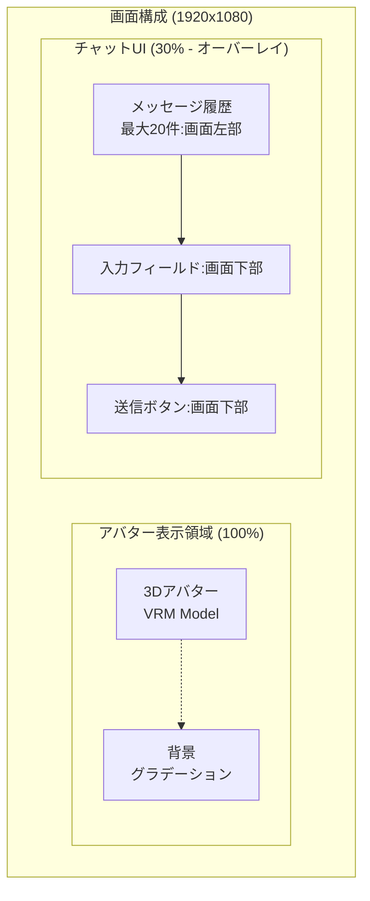
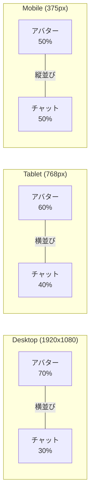

# 04. アバター表示機能

[[03-技術スタック|← 前へ]] | [[00-INDEX|目次]] | [[05-アニメーション機能|次へ →]]

---

## 4.1 概要

3D [[16-用語集#VRM|VRMモデル]]を使用したアバター表示システム。
[[03-技術スタック#Three.js|Three.js]]を使用してWebGLでレンダリング。

## 4.2 画面レイアウト



### レイアウト仕様

| 要素 | 割合 | 備考 |
|-----|------|------|
| アバター表示 | 100% | 3D Canvas領域 |
| チャットUI | 30% | オーバーレイ配置 |

詳細は [[07-UI-UX要件#レイアウト|UI/UX要件]]を参照

## 4.3 3Dモデル仕様

### VRMモデル要件

| 項目 | 仕様 | 理由 |
|------|------|------|
| フォーマット | VRM 1.0 | 統一規格、互換性 |
| ポリゴン数 | 20,000以下推奨 | パフォーマンス維持 |
| テクスチャ | 2048x2048以下 | メモリ使用量 |
| ファイルサイズ | 50MB以下 | ロード時間 |
| BlendShape | 必須 | [[05-アニメーション機能#表情制御|表情制御]]に使用 |

### 必須 BlendShape

```
表情用:
- joy (笑顔)
- sorrow (悲しみ)
- surprised (驚き)
- neutral (通常)

リップシンク用:
- mouth_a (あ)
- mouth_i (い)
- mouth_u (う)
- mouth_e (え)
- mouth_o (お)
- mouth_close (閉じ)
```

関連: [[16-用語集#BlendShape|用語集 - BlendShape]]

## 4.4 カメラ設定

### カメラ仕様

```typescript
// 固定カメラ（バストアップ）
const camera = new THREE.PerspectiveCamera(
  35,                    // FOV
  aspect,               // アスペクト比
  0.1,                  // Near
  1000                  // Far
);

camera.position.set(0, 1.4, 1.5);  // 位置
camera.lookAt(0, 1.3, 0);          // 注視点
```

### カメラ特性

```
- 固定視点（ユーザー操作不可）
- バストアップアングル
- 顔がフレーム中央
- 上半身が見える構図
```

> **注意**: Phase 1ではカメラは固定。
> ユーザーの顔認識などは不要。

## 4.5 ライティング設定

### ライト構成

```typescript
// 環境光（全体照明）
const ambientLight = new THREE.AmbientLight(0xffffff, 0.6);

// ディレクショナルライト（メインライト）
const directionalLight = new THREE.DirectionalLight(0xffffff, 0.8);
directionalLight.position.set(1, 1, 1);

// リムライト（輪郭強調）
const rimLight = new THREE.DirectionalLight(0xffffff, 0.3);
rimLight.position.set(-1, 0, -1);
```

### ライト効果

| ライト | 目的 | 強度 |
|--------|------|------|
| Ambient | 全体明るさ | 0.6 |
| Directional | メイン照明 | 0.8 |
| Rim | 輪郭強調 | 0.3 |

## 4.6 背景設定

### 背景オプション

**A. グラデーション背景（推奨）**
```typescript
// 上: 明るい青 → 下: 暗い青
const canvas = document.createElement('canvas');
const ctx = canvas.getContext('2d');
const gradient = ctx.createLinearGradient(0, 0, 0, canvas.height);
gradient.addColorStop(0, '#87CEEB');
gradient.addColorStop(1, '#4682B4');
```

**B. 単色背景**
```typescript
scene.background = new THREE.Color(0xf0f0f0);
```

**C. 環境マップ（将来拡張）**
```typescript
// Phase 2以降で実装予定
const envMap = new THREE.CubeTextureLoader().load([...]);
scene.background = envMap;
```

## 4.7 レンダリング設定

### Renderer 設定

```typescript
const renderer = new THREE.WebGLRenderer({
  canvas: canvasRef.current,
  antialias: true,        // アンチエイリアス有効
  alpha: true,            // 透明背景サポート
  powerPreference: 'high-performance'
});

renderer.setSize(width, height);
renderer.setPixelRatio(Math.min(window.devicePixelRatio, 2));
renderer.outputEncoding = THREE.sRGBEncoding;
renderer.shadowMap.enabled = false;  // Phase 1では影なし
```

### レンダリングループ

```typescript
const animate = () => {
  requestAnimationFrame(animate);
  
  // アニメーション更新
  animationController.update(deltaTime);
  lipSyncController.update(deltaTime);
  
  // レンダリング
  renderer.render(scene, camera);
};
```

関連: [[05-アニメーション機能#アニメーション制御|アニメーション制御]]

## 4.8 VRMモデルの取得方法

### 1. VRoid Studio（無料作成ツール）

```
URL: https://vroid.com/studio
用途: オリジナルアバター作成
特徴:
  ✓ 完全無料
  ✓ 初心者でも簡単
  ✓ カスタマイズ自由
  ✓ VRM形式で出力可能
```

### 2. VRoid Hub（既存モデル）

```
URL: https://hub.vroid.com/
用途: 既存アバターの利用
特徴:
  ✓ 多数のアバター公開
  ✓ 利用規約を確認必須
  ✓ 商用利用可能モデルあり
```

### 3. BOOTH（有料モデル）

```
URL: https://booth.pm/
用途: 高品質モデル購入
特徴:
  ✓ プロ制作モデル
  ✓ 商用利用可能
  ✓ サポート充実
```

## 4.9 VRMローダー実装

### 基本実装

```typescript
import * as THREE from 'three';
import { VRM, VRMLoaderPlugin } from '@pixiv/three-vrm';
import { GLTFLoader } from 'three/examples/jsm/loaders/GLTFLoader';

const loader = new GLTFLoader();
loader.register((parser) => new VRMLoaderPlugin(parser));

loader.load(
  '/assets/models/avatar.vrm',
  (gltf) => {
    const vrm = gltf.userData.vrm as VRM;
    scene.add(vrm.scene);
    
    // アバターコントローラーに登録
    avatarController.setVRM(vrm);
  },
  (progress) => {
    console.log('Loading:', (progress.loaded / progress.total) * 100, '%');
  },
  (error) => {
    console.error('Error loading VRM:', error);
  }
);
```

関連: [[09-データ構造#AvatarController|データ構造]]

## 4.10 パフォーマンス最適化

### LOD (Level of Detail)

```typescript
// 距離に応じた品質調整（Phase 2以降）
const lod = new THREE.LOD();
lod.addLevel(highDetailModel, 0);
lod.addLevel(mediumDetailModel, 50);
lod.addLevel(lowDetailModel, 100);
```

### テクスチャ最適化

```
- 適切なサイズ選択（2048x2048 max）
- mipmapの活用
- 圧縮テクスチャ（DDS/KTX2）
```

### メモリ管理

```typescript
// 不要なリソース解放
vrm.scene.traverse((object) => {
  if (object instanceof THREE.Mesh) {
    object.geometry.dispose();
    object.material.dispose();
  }
});
```

詳細は [[08-非機能要件#パフォーマンス|非機能要件]]を参照

## 4.11 レスポンシブ対応



### リサイズ処理

```typescript
window.addEventListener('resize', () => {
  const width = window.innerWidth;
  const height = window.innerHeight;
  
  camera.aspect = width / height;
  camera.updateProjectionMatrix();
  
  renderer.setSize(width, height);
});
```

詳細は [[07-UI-UX要件#レスポンシブ|UI/UX要件]]を参照

## 4.12 関連ドキュメント

- [[05-アニメーション機能|アニメーション機能]] - アバターの動き
- [[07-UI-UX要件|UI/UX要件]] - 画面レイアウト
- [[09-データ構造|データ構造]] - AvatarController
- [[11-ファイル構成|ファイル構成]] - モデルファイル配置

---

**タグ**: #アバター #3D #VRM #Three.js
**更新日**: 2025-10-30
