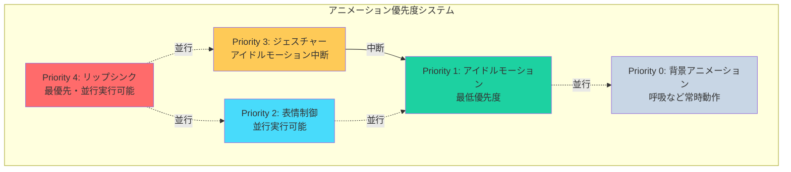
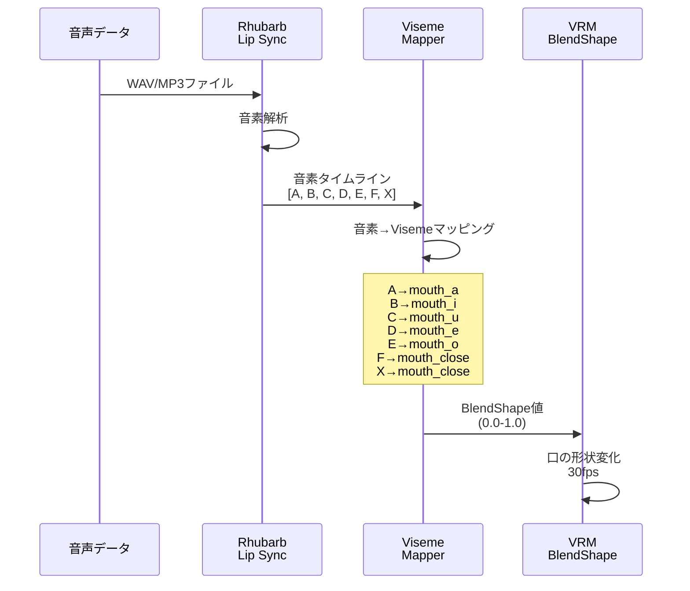
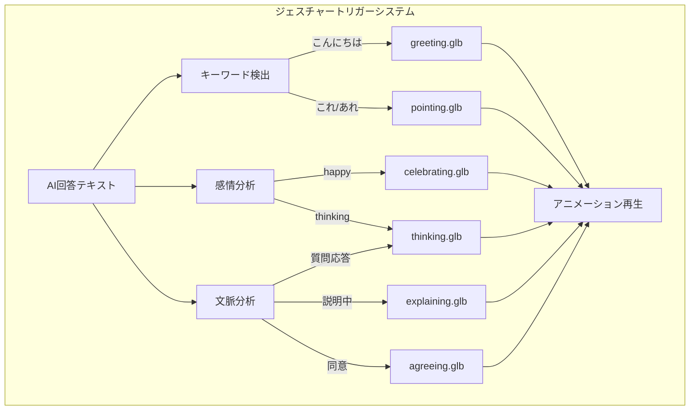
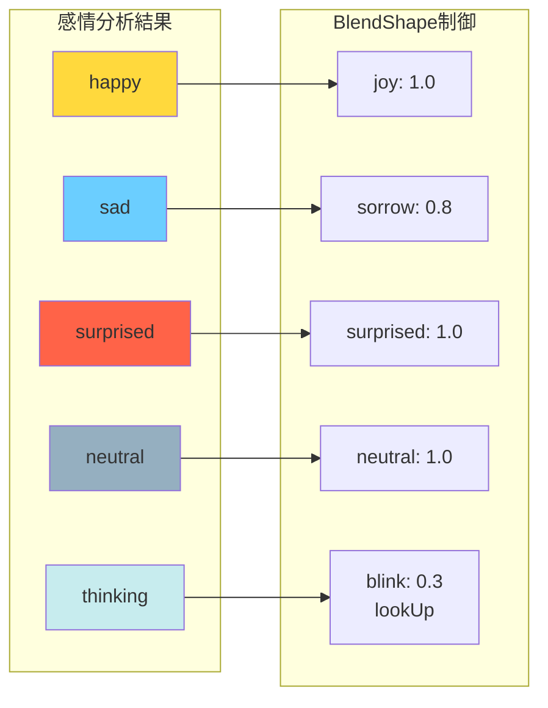
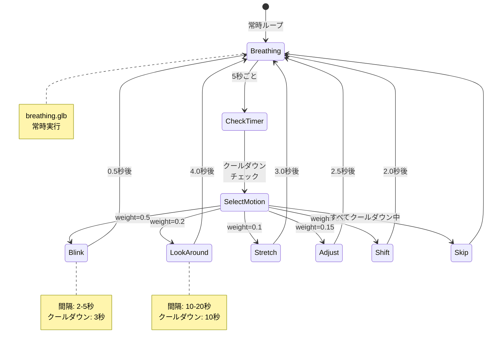
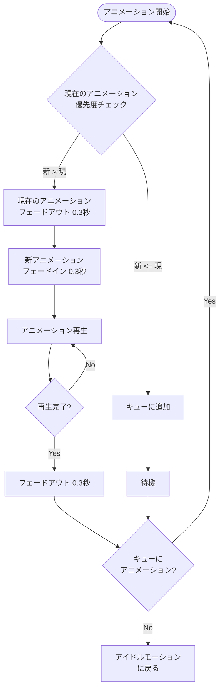

# 05. アニメーション機能

[[04-アバター表示機能|← 前へ]] | [[00-INDEX|目次]] | [[06-AI対話機能|次へ →]]

---

## 5.1 概要

アバターの動きを制御するアニメーションシステム。
事前定義された[[16-用語集#GLB|GLBアニメーション]]ファイルを使用。

> **重要**: カメラ入力は不要。すべて事前定義のアニメーションを使用。

## 5.2 アニメーション階層構造



### 優先度定義

| Priority | 種類 | 動作 | 関連セクション |
|----------|------|------|--------------|
| 4 | リップシンク | 最優先、他と並行可能 | [[#5.3 リップシンク]] |
| 3 | ジェスチャー | アイドル中断 | [[#5.4 ジェスチャー]] |
| 2 | 表情 | 他と並行可能 | [[#5.5 表情制御]] |
| 1 | アイドル | 最低優先度 | [[#5.6 アイドルモーション]] |
| 0 | 背景 | 常時動作 | [[#5.6 アイドルモーション]] |

関連: [[09-データ構造#AnimationPriority|データ構造]]

## 5.3 リップシンク

### 概要

[[16-用語集#リップシンク|リップシンク]]は音声と口の動きを同期させる技術。
[[03-技術スタック#Rhubarb|Rhubarb Lip Sync]]で音素を抽出し、
[[16-用語集#Viseme|Viseme]]に変換して[[04-アバター表示機能#BlendShape|BlendShape]]を制御。

### 処理フロー



### Visemeマッピング

| Rhubarb音素 | 発音 | Viseme | VRM BlendShape | 値 |
|------------|------|--------|----------------|-----|
| A | あ | aa | mouth_a | 1.0 |
| B | い | ih | mouth_i | 1.0 |
| C | う | uw | mouth_u | 1.0 |
| D | え | eh | mouth_e | 1.0 |
| E | お | oh | mouth_o | 1.0 |
| F | ん,m | nn | mouth_close | 0.8 |
| X | 閉じ | silent | mouth_close | 0.0 |

### リップシンクデータ構造

```typescript
interface LipSyncData {
  duration: number;        // 秒
  mouthCues: MouthCue[];
}

interface MouthCue {
  start: number;   // 開始時間(秒)
  end: number;     // 終了時間(秒)
  value: string;   // 音素 (A,B,C,D,E,F,X)
}
```

### 実装例

```typescript
class LipSyncController {
  private currentData: LipSyncData | null = null;
  private currentTime: number = 0;
  
  loadLipSyncData(data: LipSyncData) {
    this.currentData = data;
    this.currentTime = 0;
  }
  
  update(deltaTime: number) {
    if (!this.currentData) return;
    
    this.currentTime += deltaTime;
    
    // 現在の音素を取得
    const cue = this.getCurrentCue();
    if (cue) {
      const viseme = this.mapToViseme(cue.value);
      this.applyViseme(viseme);
    }
  }
  
  private mapToViseme(phoneme: string): string {
    const map: Record<string, string> = {
      'A': 'mouth_a',
      'B': 'mouth_i',
      'C': 'mouth_u',
      'D': 'mouth_e',
      'E': 'mouth_o',
      'F': 'mouth_close',
      'X': 'mouth_close'
    };
    return map[phoneme] || 'mouth_close';
  }
}
```

関連:
- [[06-AI対話機能#音声合成|AI対話機能 - 音声合成]]
- [[10-API仕様#LipSyncデータ|API仕様]]

## 5.4 ジェスチャー

### 概要

事前定義されたGLBアニメーションファイルを使用。
[[06-AI対話機能#感情分析|AIの感情分析]]やキーワードに基づいてトリガー。

### ジェスチャー一覧

| アニメーション | ファイル | トリガー条件 | 再生時間 | 優先度 |
|---------------|---------|-------------|---------|-------|
| 挨拶 | greeting.glb | 「こんにちは」含む | 2.5秒 | 3 |
| 指差し | pointing.glb | 「これ」「あれ」含む | 2.0秒 | 3 |
| 頷き | nodding.glb | 肯定的な返答 | 1.5秒 | 3 |
| 考え中 | thinking.glb | 質問への回答開始時 | 3.0秒 | 3 |
| 説明 | explaining.glb | 説明中（デフォルト） | 3.5秒 | 3 |
| 喜び | celebrating.glb | happy感情 | 2.8秒 | 3 |
| 肩すくめ | shrugging.glb | 不明・分からない | 2.5秒 | 3 |
| 同意 | agreeing.glb | 同意・確認 | 2.0秒 | 3 |

### トリガーシステム



### アニメーション選択ロジック

```typescript
const animationTriggers = {
  // キーワードベース
  keywords: {
    'こんにちは': 'greeting',
    'やあ': 'greeting',
    'これ': 'pointing',
    'あれ': 'pointing',
    'そうだね': 'nodding',
    'すごい': 'celebrating',
  },
  
  // 感情ベース
  emotions: {
    'happy': ['celebrating', 'nodding'],
    'sad': ['shrugging'],
    'surprised': ['surprised'],
    'thinking': ['thinking'],
    'neutral': ['explaining'],
  },
};

function selectAnimation(text: string, emotion: string): string {
  // 1. キーワード優先
  for (const [keyword, animation] of Object.entries(animationTriggers.keywords)) {
    if (text.includes(keyword)) return animation;
  }
  
  // 2. 感情ベース
  const emotionAnims = animationTriggers.emotions[emotion];
  if (emotionAnims) {
    return emotionAnims[Math.floor(Math.random() * emotionAnims.length)];
  }
  
  // 3. デフォルト
  return 'explaining';
}
```

### アニメーション取得方法

**1. Mixamo（推奨・無料）**
```
URL: https://www.mixamo.com/
特徴:
  ✓ 大量のモーションデータ
  ✓ 完全無料
  ✓ FBX/GLB形式でダウンロード
  ✓ VRMに変換可能
```

**2. VRoid Hub**
```
URL: https://hub.vroid.com/
特徴:
  ✓ VRM専用アニメーション
  ✓ そのまま使用可能
```

**3. Blender（自作）**
```
ツール: Blender + VRM Addon
特徴:
  ✓ カスタムアニメーション作成
  ✓ 完全なコントロール
  ✓ 学習コスト高い
```

関連: [[11-ファイル構成#アニメーションファイル|ファイル構成]]

## 5.5 表情制御

### 概要

[[04-アバター表示機能#BlendShape|BlendShape]]を使用した表情変化。
[[06-AI対話機能#感情分析|AI感情分析]]結果に基づいて表情を設定。

### 表情マッピング



### 表情定義

| 感情 | BlendShape | 値 | 説明 |
|------|-----------|-----|------|
| happy | joy | 1.0 | 笑顔 |
| sad | sorrow | 0.8 | 悲しみ |
| surprised | surprised | 1.0 | 驚き |
| neutral | neutral | 1.0 | 通常 |
| thinking | blink + lookUp | 0.3 + 適用 | 考え中 |

### 実装例

```typescript
class EmotionController {
  private vrm: VRM;
  
  setEmotion(emotion: EmotionType, intensity: number = 1.0) {
    const expressionManager = this.vrm.expressionManager;
    
    // すべての表情をリセット
    this.resetExpressions();
    
    // 感情に応じた表情を設定
    switch (emotion) {
      case 'happy':
        expressionManager.setValue('joy', intensity);
        break;
      case 'sad':
        expressionManager.setValue('sorrow', intensity * 0.8);
        break;
      case 'surprised':
        expressionManager.setValue('surprised', intensity);
        break;
      case 'thinking':
        expressionManager.setValue('blink', 0.3);
        this.lookUp();
        break;
      default:
        expressionManager.setValue('neutral', 1.0);
    }
    
    expressionManager.update();
  }
}
```

### 表情遷移

```
遷移時間: 0.5秒
補間: イージング（ease-in-out）
```

## 5.6 アイドルモーション

### 概要

ユーザーが何も操作していない待機時に実行されるランダムなモーション。
「放置ゲー」のようなイメージ。

### モーション一覧

| モーション | ファイル | 特性 | 実行間隔 | 再生時間 | weight |
|-----------|---------|------|---------|---------|--------|
| 呼吸 | breathing.glb | 常時ループ | - | ループ | 1.0 |
| まばたき | blink.glb | 高頻度 | 2-5秒 | 0.5秒 | 0.5 |
| 視線移動 | lookAround.glb | 低頻度 | 10-20秒 | 4.0秒 | 0.2 |
| 伸び | stretch.glb | 低頻度 | 30-60秒 | 3.0秒 | 0.1 |
| 服を直す | adjustClothes.glb | 中頻度 | 20-40秒 | 2.5秒 | 0.15 |
| 体重移動 | idleShift.glb | 中頻度 | 8-15秒 | 2.0秒 | 0.3 |

### 実行フロー



### 実装例

```typescript
interface IdleMotion {
  name: string;
  animation: string;
  minInterval: number;
  maxInterval: number;
  duration: number;
  weight: number;
  cooldown: number;
}

class IdleMotionController {
  private motions: IdleMotion[] = [
    {
      name: 'breathing',
      animation: 'breathing.glb',
      minInterval: 0,
      maxInterval: 0,
      duration: 0,  // ループ
      weight: 1.0,
      cooldown: 0
    },
    {
      name: 'blink',
      animation: 'blink.glb',
      minInterval: 2000,
      maxInterval: 5000,
      duration: 500,
      weight: 0.5,
      cooldown: 3000
    },
    // ... 他のモーション
  ];
  
  private lastExecution: Map<string, number> = new Map();
  
  selectNextMotion(): IdleMotion | null {
    const now = Date.now();
    const available = this.motions.filter(m => {
      const lastTime = this.lastExecution.get(m.name) || 0;
      return now - lastTime >= m.cooldown;
    });
    
    // 重み付きランダム選択
    const totalWeight = available.reduce((sum, m) => sum + m.weight, 0);
    let random = Math.random() * totalWeight;
    
    for (const motion of available) {
      random -= motion.weight;
      if (random <= 0) {
        this.lastExecution.set(motion.name, now);
        return motion;
      }
    }
    
    return null;
  }
  
  start() {
    // 呼吸アニメーション開始
    this.playAnimation('breathing', true);
    
    // 5秒ごとにチェック
    setInterval(() => {
      const motion = this.selectNextMotion();
      if (motion && motion.name !== 'breathing') {
        this.playAnimation(motion.animation, false);
      }
    }, 5000);
  }
}
```

関連: [[09-データ構造#IdleMotionController|データ構造]]

## 5.7 アニメーション遷移

### 遷移フロー



### 遷移パラメータ

| 項目 | 値 | 説明 |
|------|-----|------|
| フェードイン | 0.3秒 | 新アニメーション開始時 |
| フェードアウト | 0.3秒 | アニメーション終了時 |
| ブレンド方式 | 線形補間 | アニメーション間の補間 |

### 実装例

```typescript
class AnimationController {
  private currentAnimations: Map<AnimationPriority, THREE.AnimationAction> = new Map();
  
  playAnimation(
    animation: THREE.AnimationClip,
    priority: AnimationPriority,
    loop: boolean = false
  ) {
    // 優先度チェック
    for (const [p, action] of this.currentAnimations) {
      if (p < priority) {
        // 優先度が低いアニメーションは中断
        action.fadeOut(0.3);
        this.currentAnimations.delete(p);
      }
    }
    
    // 新しいアニメーション再生
    const action = this.mixer.clipAction(animation);
    action.setLoop(loop ? THREE.LoopRepeat : THREE.LoopOnce, Infinity);
    action.fadeIn(0.3);
    action.play();
    
    this.currentAnimations.set(priority, action);
  }
}
```

関連: [[09-データ構造#AnimationController|データ構造]]

## 5.8 関連ドキュメント

- [[04-アバター表示機能|アバター表示機能]] - アバターの基本設定
- [[06-AI対話機能|AI対話機能]] - 感情分析とトリガー
- [[09-データ構造|データ構造]] - コントローラークラス
- [[11-ファイル構成|ファイル構成]] - アニメーションファイル配置

---

**タグ**: #アニメーション #リップシンク #ジェスチャー #表情
**更新日**: 2025-10-30
