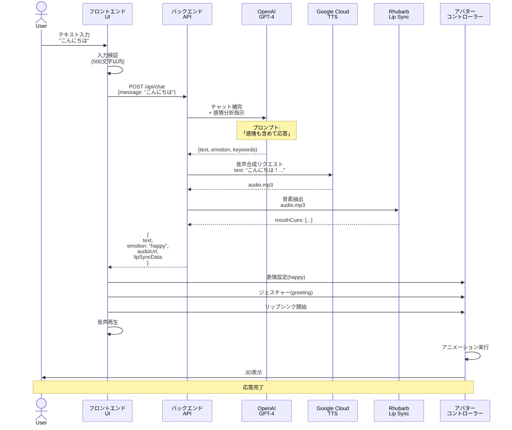
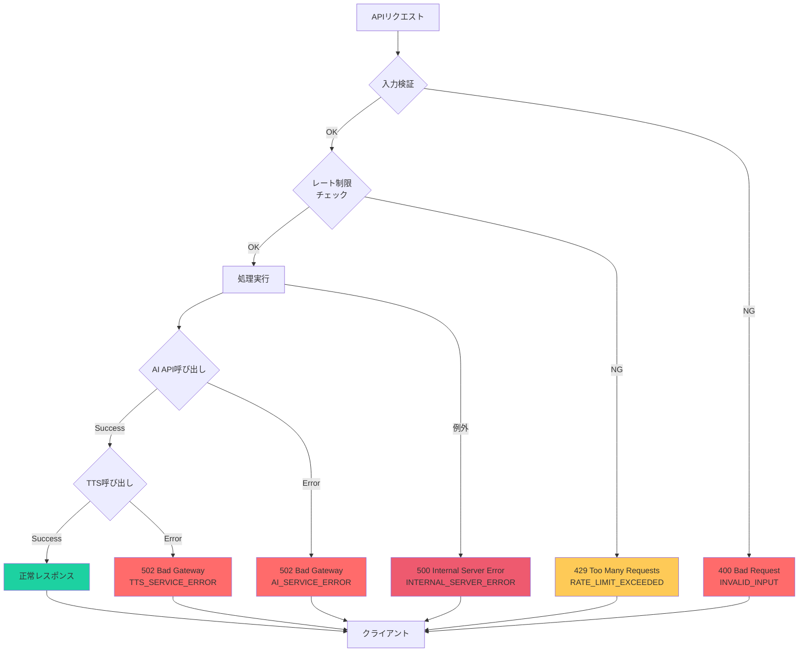

# 06. AI対話機能

[[05-アニメーション機能|← 前へ]] | [[00-INDEX|目次]] | [[07-UI-UX要件|次へ →]]

---

## 6.1 概要

[[03-技術スタック#OpenAI|OpenAI GPT-4]]を使用したAI対話システム。
テキスト入力に対して自然な応答を生成し、感情分析も同時に行う。

## 6.2 対話処理フロー



関連:
- [[02-システム構成#データフロー|システム構成 - データフロー]]
- [[10-API仕様|API仕様]]

## 6.3 入力仕様

### 入力制限

| 項目 | 仕様 | 理由 |
|------|------|------|
| 入力方式 | テキストのみ | Phase 1スコープ |
| 最大文字数 | 500文字 | API制限・コスト |
| 送信トリガー | Enter / 送信ボタン | 標準UI |
| 連続送信制限 | 前の応答完了まで | 負荷軽減 |
| 文字コード | UTF-8 | 日本語対応 |

### バリデーション

```typescript
function validateInput(message: string): { valid: boolean; error?: string } {
  // 空文字チェック
  if (!message.trim()) {
    return { valid: false, error: 'メッセージを入力してください' };
  }
  
  // 文字数チェック
  if (message.length > 500) {
    return { valid: false, error: 'メッセージは500文字以内で入力してください' };
  }
  
  // 禁止文字チェック（必要に応じて）
  // ...
  
  return { valid: true };
}
```

関連: [[07-UI-UX要件#入力UI|UI/UX要件]]

## 6.4 OpenAI統合

### プロンプト設計

```typescript
const systemPrompt = `あなたは親しみやすいAIアシスタントです。
ユーザーとの対話において、以下を守ってください：

1. 自然で親しみやすい口調で応答する
2. 簡潔かつ分かりやすい説明を心がける
3. 必要に応じて具体例を挙げる

応答時は以下の形式で感情情報も含めてください：
{
  "text": "応答テキスト",
  "emotion": "happy|sad|surprised|neutral|thinking",
  "intensity": 0.0-1.0,
  "keywords": ["キーワード1", "キーワード2"]
}`;

const userPrompt = `${userMessage}

上記のメッセージに対して、感情情報を含めた形式で応答してください。`;
```

### API呼び出し

```python
from openai import OpenAI

client = OpenAI(api_key=os.getenv("OPENAI_API_KEY"))

def generate_response(message: str, history: list) -> dict:
    """AI応答を生成"""
    
    messages = [
        {"role": "system", "content": SYSTEM_PROMPT},
        *history,
        {"role": "user", "content": message}
    ]
    
    response = client.chat.completions.create(
        model="gpt-4",
        messages=messages,
        temperature=0.7,
        max_tokens=500,
        response_format={"type": "json_object"}
    )
    
    result = json.loads(response.choices[0].message.content)
    
    return {
        "text": result["text"],
        "emotion": result["emotion"],
        "intensity": result.get("intensity", 0.8),
        "keywords": result.get("keywords", [])
    }
```

### 感情分析

**感情タイプ:**
```typescript
type EmotionType = 
  | 'happy'      // 喜び、楽しい
  | 'sad'        // 悲しい、残念
  | 'surprised'  // 驚き
  | 'neutral'    // 通常、平静
  | 'thinking';  // 考え中、疑問
```

**感情の使用例:**
- `happy`: 挨拶、褒められた、成功
- `sad`: 失敗、残念な知らせ
- `surprised`: 予想外の情報
- `neutral`: 通常の会話
- `thinking`: 質問への回答、複雑な説明

関連: [[05-アニメーション機能#表情制御|アニメーション機能 - 表情制御]]

## 6.5 音声合成

### Google Cloud TTS 設定

```python
from google.cloud import texttospeech

def synthesize_speech(text: str) -> bytes:
    """テキストを音声に変換"""
    
    client = texttospeech.TextToSpeechClient()
    
    # 音声合成リクエスト
    synthesis_input = texttospeech.SynthesisInput(text=text)
    
    # 音声設定（日本語、女性、WaveNet）
    voice = texttospeech.VoiceSelectionParams(
        language_code="ja-JP",
        name="ja-JP-Wavenet-A",  # 女性の声
        ssml_gender=texttospeech.SsmlVoiceGender.FEMALE
    )
    
    # オーディオ設定
    audio_config = texttospeech.AudioConfig(
        audio_encoding=texttospeech.AudioEncoding.MP3,
        speaking_rate=1.0,    # 速度
        pitch=0.0,            # ピッチ
        volume_gain_db=0.0    # 音量
    )
    
    # 音声合成実行
    response = client.synthesize_speech(
        input=synthesis_input,
        voice=voice,
        audio_config=audio_config
    )
    
    return response.audio_content
```

### 音声パラメータ

| パラメータ | 値 | 説明 |
|-----------|-----|------|
| language_code | ja-JP | 日本語 |
| voice_name | ja-JP-Wavenet-A | 女性の声 |
| speaking_rate | 1.0 | 標準速度 |
| pitch | 0.0 | 標準ピッチ |
| audio_encoding | MP3 | 音声形式 |

**代替ボイス:**
- `ja-JP-Wavenet-B`: 男性
- `ja-JP-Wavenet-C`: 男性
- `ja-JP-Wavenet-D`: 男性

関連: [[03-技術スタック#Google Cloud TTS|技術スタック]]

## 6.6 リップシンク生成

### Rhubarb Lip Sync

```python
import subprocess
import json

def extract_phonemes(audio_path: str) -> dict:
    """音声ファイルから音素を抽出"""
    
    # Rhubarbコマンド実行
    result = subprocess.run(
        [
            './tools/rhubarb/rhubarb',
            '-f', 'json',
            '-o', '/tmp/lipsync.json',
            audio_path
        ],
        capture_output=True,
        text=True
    )
    
    if result.returncode != 0:
        raise Exception(f"Rhubarb error: {result.stderr}")
    
    # JSON読み込み
    with open('/tmp/lipsync.json', 'r') as f:
        data = json.load(f)
    
    # フロントエンド用に変換
    return {
        "duration": data["metadata"]["duration"],
        "mouthCues": [
            {
                "start": cue["start"],
                "end": cue["end"],
                "value": cue["value"]
            }
            for cue in data["mouthCues"]
        ]
    }
```

### リップシンクデータ形式

```json
{
  "duration": 3.5,
  "mouthCues": [
    {"start": 0.0, "end": 0.2, "value": "X"},
    {"start": 0.2, "end": 0.4, "value": "A"},
    {"start": 0.4, "end": 0.6, "value": "B"},
    {"start": 0.6, "end": 0.8, "value": "C"}
  ]
}
```

関連: [[05-アニメーション機能#リップシンク|アニメーション機能 - リップシンク]]

## 6.7 会話履歴管理

### メッセージ構造

```typescript
interface Message {
  id: string;
  role: 'user' | 'assistant';
  content: string;
  timestamp: Date;
  emotion?: EmotionType;
  audioUrl?: string;
}

interface ConversationHistory {
  messages: Message[];
  maxMessages: number;  // 20件まで保持
}
```

### 履歴管理

```typescript
class ConversationManager {
  private messages: Message[] = [];
  private readonly MAX_MESSAGES = 20;
  
  addMessage(message: Message) {
    this.messages.push(message);
    
    // 最大件数を超えたら古いものを削除
    if (this.messages.length > this.MAX_MESSAGES) {
      this.messages.shift();
    }
  }
  
  getHistory(): Message[] {
    return this.messages;
  }
  
  clear() {
    this.messages = [];
  }
  
  // API送信用に変換
  toAPIFormat(): Array<{role: string; content: string}> {
    return this.messages.map(m => ({
      role: m.role,
      content: m.content
    }));
  }
}
```

> **注意**: Phase 1では会話履歴はメモリ内のみ。
> ページリロードでクリアされる。
> 永続化はPhase 2以降で実装予定。

## 6.8 エラーハンドリング

### エラーケース



### エラーハンドリング実装

```python
from fastapi import HTTPException

async def handle_chat(request: ChatRequest):
    try:
        # 入力検証
        if not request.message or len(request.message) > 500:
            raise HTTPException(
                status_code=400,
                detail="Invalid input"
            )
        
        # AI応答生成
        try:
            ai_response = await generate_response(request.message)
        except Exception as e:
            raise HTTPException(
                status_code=502,
                detail="AI service error"
            )
        
        # 音声合成
        try:
            audio = await synthesize_speech(ai_response["text"])
        except Exception as e:
            raise HTTPException(
                status_code=502,
                detail="TTS service error"
            )
        
        # リップシンク生成
        lipsync_data = await extract_phonemes(audio)
        
        return {
            "text": ai_response["text"],
            "emotion": ai_response["emotion"],
            "audioUrl": save_audio(audio),
            "lipSyncData": lipsync_data
        }
        
    except HTTPException:
        raise
    except Exception as e:
        logger.error(f"Unexpected error: {e}")
        raise HTTPException(
            status_code=500,
            detail="Internal server error"
        )
```

関連: [[10-API仕様#エラーレスポンス|API仕様 - エラーレスポンス]]

## 6.9 レート制限

### 制限設定

```python
from slowapi import Limiter
from slowapi.util import get_remote_address

limiter = Limiter(key_func=get_remote_address)

@app.post("/api/chat")
@limiter.limit("10/minute")  # 1分間に10リクエストまで
async def chat_endpoint(request: ChatRequest):
    # ...
```

### 制限値

| 項目 | 制限 | 理由 |
|------|------|------|
| リクエスト数 | 10/分 | OpenAI API制限 |
| 同時接続数 | 100 | サーバー負荷 |
| メッセージサイズ | 500文字 | コスト管理 |

## 6.10 パフォーマンス最適化

### キャッシング

```python
from functools import lru_cache
from hashlib import md5

@lru_cache(maxsize=100)
def get_cached_response(message_hash: str):
    # 同じメッセージに対するキャッシュ
    pass

def chat_with_cache(message: str):
    # メッセージのハッシュ値生成
    message_hash = md5(message.encode()).hexdigest()
    
    # キャッシュチェック
    cached = get_cached_response(message_hash)
    if cached:
        return cached
    
    # 新規生成
    response = generate_response(message)
    return response
```

### 非同期処理

```python
import asyncio

async def process_chat(message: str):
    # AI応答とTTSを並列実行
    ai_task = asyncio.create_task(generate_response(message))
    
    ai_response = await ai_task
    
    # TTSとリップシンクは直列（音声が必要なため）
    audio = await synthesize_speech(ai_response["text"])
    lipsync = await extract_phonemes(audio)
    
    return {
        **ai_response,
        "audioUrl": audio_url,
        "lipSyncData": lipsync
    }
```

関連: [[08-非機能要件#パフォーマンス|非機能要件]]

## 6.11 関連ドキュメント

- [[05-アニメーション機能|アニメーション機能]] - 感情→表情マッピング
- [[07-UI-UX要件|UI/UX要件]] - チャットUI設計
- [[10-API仕様|API仕様]] - エンドポイント詳細
- [[08-非機能要件|非機能要件]] - パフォーマンス要件

---

**タグ**: #AI #OpenAI #対話 #音声合成
**更新日**: 2025-10-30
