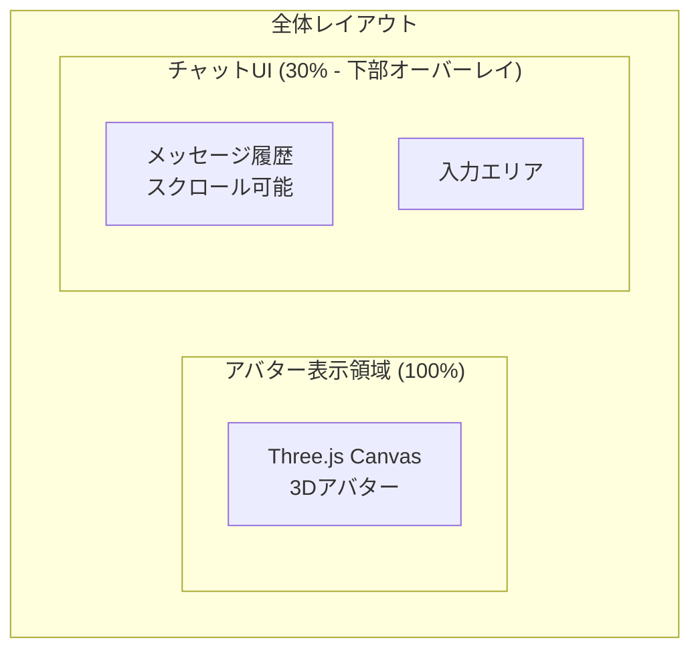
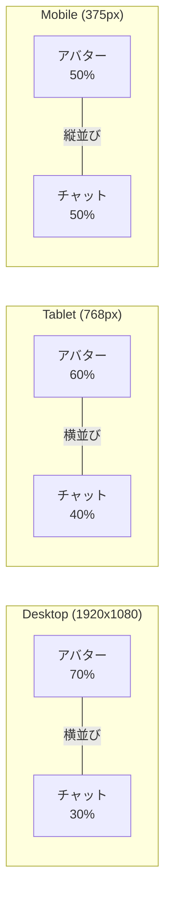

# 07. UI/UX要件

[[06-AI対話機能|← 前へ]] | [[00-INDEX|目次]] | [[08-非機能要件|次へ →]]

---

## 7.1 概要

ユーザーインターフェース設計と操作性の要件。
[[04-アバター表示機能#画面レイアウト|アバター表示]]と統合されたチャットUIを提供。

## 7.2 画面構成

### レイアウト図



### 配置仕様

| 要素 | 位置 | サイズ | スタイル |
|------|------|--------|---------|
| アバターCanvas | 全画面 | 100% | z-index: 1 |
| チャットUI | 下部 | 30% | z-index: 10, 半透明 |
| メッセージ履歴 | チャット左部 | 30% | スクロール可 |
| 入力エリア | チャット下部 | 30% | 固定 |

## 7.3 チャットUI詳細

### メッセージ表示

```
┌─────────────────────────────┐
│ [AI] こんにちは！           │ ← 左寄せ、灰色背景
│      10:30                  │
├─────────────────────────────┤
│           天気は？ [User]   │ ← 右寄せ、青色背景
│                    10:31    │
├─────────────────────────────┤
│ [AI] 今日は晴れです         │
│      10:31                  │
└─────────────────────────────┘
```

### スタイリング

**メッセージバブル:**
```css
.message-user {
  background: rgba(74, 144, 226, 0.9);
  color: white;
  align-self: flex-end;
  border-radius: 18px 18px 4px 18px;
}

.message-assistant {
  background: rgba(232, 232, 232, 0.9);
  color: #333;
  align-self: flex-start;
  border-radius: 18px 18px 18px 4px;
}
```

**チャットコンテナ:**
```css
.chat-container {
  background: rgba(0, 0, 0, 0.6);
  backdrop-filter: blur(10px);
  border-radius: 12px 12px 0 0;
}
```

## 7.4 入力UI

### 入力フィールド

```
┌────────────────────────────────┐
│ [入力欄: メッセージを入力...] [送信] │
└────────────────────────────────┘
```

**機能:**
- プレースホルダー: "メッセージを入力..."
- 最大文字数: 500文字
- リアルタイム文字数表示
- Enterキーで送信
- Shift+Enterで改行

**実装例:**
```tsx
<div className="input-area">
  <textarea
    placeholder="メッセージを入力..."
    maxLength={500}
    value={message}
    onChange={(e) => setMessage(e.target.value)}
    onKeyDown={(e) => {
      if (e.key === 'Enter' && !e.shiftKey) {
        e.preventDefault();
        handleSend();
      }
    }}
  />
  <button onClick={handleSend} disabled={!message.trim()}>
    送信
  </button>
  <span className="char-count">{message.length}/500</span>
</div>
```

関連: [[06-AI対話機能#入力仕様|AI対話機能 - 入力仕様]]

## 7.5 レスポンシブデザイン

### ブレークポイント



### CSS実装

```css
/* Desktop */
@media (min-width: 1024px) {
  .avatar-canvas { height: 70vh; }
  .chat-ui { height: 30vh; }
}

/* Tablet */
@media (max-width: 1023px) and (min-width: 768px) {
  .avatar-canvas { height: 60vh; }
  .chat-ui { height: 40vh; }
}

/* Mobile */
@media (max-width: 767px) {
  .avatar-canvas { height: 50vh; }
  .chat-ui { height: 50vh; }
  .layout { flex-direction: column; }
}
```

## 7.6 ローディング状態

### ローディング表示

```
AI応答待機中:
┌─────────────────┐
│ [AI] ●●●       │ ← アニメーション
└─────────────────┘

音声生成中:
┌─────────────────┐
│ 🔊 音声生成中... │
└─────────────────┘
```

**実装:**
```tsx
{isLoading && (
  <div className="loading-message">
    <div className="typing-indicator">
      <span></span>
      <span></span>
      <span></span>
    </div>
  </div>
)}
```

## 7.7 エラー表示

### エラーメッセージ

```
┌─────────────────────────┐
│ ⚠️ エラーが発生しました │
│ もう一度お試しください  │
│ [再試行]                │
└─────────────────────────┘
```

**エラータイプ:**
- ネットワークエラー
- API エラー
- タイムアウト
- 入力エラー

関連: [[06-AI対話機能#エラーハンドリング|AI対話機能 - エラーハンドリング]]

## 7.8 アクセシビリティ

### 対応項目

```
✓ キーボード操作対応
✓ スクリーンリーダー対応
✓ 高コントラストモード
✓ フォントサイズ調整
✓ ARIA属性適用
```

**実装例:**
```tsx
<button
  aria-label="メッセージを送信"
  aria-disabled={!message.trim()}
  role="button"
  tabIndex={0}
>
  送信
</button>
```

## 7.9 関連ドキュメント

- [[04-アバター表示機能|アバター表示機能]] - 画面レイアウト
- [[06-AI対話機能|AI対話機能]] - 入力処理
- [[08-非機能要件|非機能要件]] - ブラウザ互換性

---

**タグ**: #UI #UX #デザイン #レスポンシブ
**更新日**: 2025-10-30
