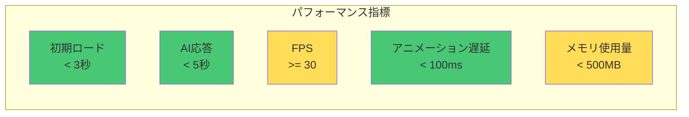

# 08. 非機能要件

[[07-UI-UX要件|← 前へ]] | [[00-INDEX|目次]] | [[09-データ構造|次へ →]]

---

## 8.1 パフォーマンス要件

### パフォーマンス目標



| 指標 | 目標値 | 測定方法 |
|------|--------|---------|
| 初期ロード時間 | 3秒以内 | Lighthouse Performance |
| AI応答時間 | 5秒以内 | API レスポンスタイム |
| FPS | 30fps以上 | Chrome DevTools Performance |
| アニメーション遅延 | 100ms以内 | requestAnimationFrame |
| メモリ使用量 | 500MB以下 | Chrome Task Manager |

### 最適化手法

**フロントエンド:**
- コード分割（Code Splitting）
- 遅延ローディング（Lazy Loading）
- アセット圧縮（Gzip/Brotli）
- テクスチャ最適化
- [[04-アバター表示機能#パフォーマンス最適化|VRMモデル最適化]]

**バックエンド:**
- レスポンスキャッシング
- 非同期処理
- データベースクエリ最適化（Phase 2以降）
- [[06-AI対話機能#パフォーマンス最適化|AI API最適化]]

関連:
- [[03-技術スタック#パフォーマンス考慮事項|技術スタック]]
- [[06-AI対話機能#パフォーマンス最適化|AI対話機能]]

## 8.2 スケーラビリティ

### 同時接続数

```
Phase 1目標:
- 同時接続: 100ユーザー
- 1秒あたりリクエスト: 10 req/sec
```

### 拡張計画（Phase 2以降）

```
- ロードバランサー導入
- CDN活用
- データベースレプリケーション
- キャッシュサーバー（Redis）
```

## 8.3 可用性

### 稼働率目標

```
目標稼働率: 99%
月間ダウンタイム: < 7.2時間
```

### 監視項目

- サーバーヘルスチェック
- APIレスポンスタイム
- エラーレート
- リソース使用率

## 8.4 セキュリティ

### セキュリティ対策

**認証・認可:**
```
Phase 1: なし
Phase 2: JWT認証実装予定
```

**データ保護:**
- HTTPS通信必須
- API キー環境変数管理
- 入力サニタイズ
- XSS対策
- CSRF対策
- CORS設定

**実装例:**
```python
# FastAPI CORS設定
from fastapi.middleware.cors import CORSMiddleware

app.add_middleware(
    CORSMiddleware,
    allow_origins=["https://yourdomain.com"],
    allow_credentials=True,
    allow_methods=["POST", "GET"],
    allow_headers=["*"],
)
```

```typescript
// フロントエンド入力サニタイズ
import DOMPurify from 'dompurify';

const sanitizedInput = DOMPurify.sanitize(userInput);
```

## 8.5 互換性

### ブラウザ対応

| ブラウザ | バージョン | 対応状況 |
|---------|-----------|---------|
| Chrome | 100+ | ✅ 完全対応 |
| Firefox | 100+ | ✅ 完全対応 |
| Safari | 15+ | ✅ 完全対応 |
| Edge | 100+ | ✅ 完全対応 |
| Opera | 85+ | ⚠️ 基本対応 |
| IE11 | - | ❌ 非対応 |

### 必須機能

```
- WebGL 2.0
- ES2020+
- Web Audio API
- Fetch API
- WebAssembly（Rhubarb用）
```

### OS対応

```
Desktop:
- Windows 10/11
- macOS 12+
- Linux (Ubuntu 20.04+)

Mobile:
- iOS 15+
- Android 11+
```

## 8.6 保守性

### コード品質

**リンター/フォーマッター:**
```
Frontend: ESLint + Prettier
Backend: Ruff + Black
```

**テストカバレッジ:**
```
目標: 70%以上
重要機能: 90%以上
```

### ドキュメント

```
- コード内コメント
- API ドキュメント（自動生成）
- README.md
- [[00-INDEX|仕様書]]（本ドキュメント）
```

## 8.7 データ管理

### データ保持

**Phase 1:**
```
- 会話履歴: メモリ内のみ（最大20件）
- 音声ファイル: 一時保存（1時間後削除）
- ログ: 標準出力のみ
```

**Phase 2以降:**
```
- データベース導入
- 永続化ストレージ
- ログ管理システム
```

## 8.8 バックアップ・復旧

### バックアップ計画（Phase 2以降）

```
- データベース: 日次バックアップ
- 設定ファイル: バージョン管理
- ユーザーデータ: 週次バックアップ
```

### 災害復旧

```
RTO (Recovery Time Objective): 4時間
RPO (Recovery Point Objective): 1日
```

## 8.9 コンプライアンス

### プライバシー

```
- 個人情報の最小化
- データ暗号化
- プライバシーポリシー（Phase 2）
```

### ライセンス

**使用ライブラリ:**
```
- Three.js: MIT
- React: MIT
- FastAPI: MIT
- @pixiv/three-vrm: MIT
```

**外部サービス:**
```
- OpenAI API: 利用規約遵守
- Google Cloud TTS: 利用規約遵守
```

## 8.10 関連ドキュメント

- [[03-技術スタック|技術スタック]] - 技術選定理由
- [[13-テスト要件|テスト要件]] - テスト計画
- [[14-デプロイメント|デプロイメント]] - 本番環境設定

---

**タグ**: #非機能要件 #パフォーマンス #セキュリティ
**更新日**: 2025-10-30
