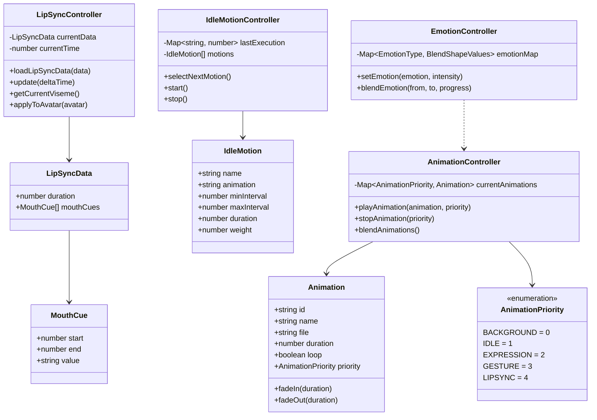

# 09. データ構造

[[08-非機能要件|← 前へ]] | [[00-INDEX|目次]] | [[10-API仕様|次へ →]]

---

## 9.1 クラス図



関連:
- [[05-アニメーション機能|アニメーション機能]]
- [[06-AI対話機能|AI対話機能]]

## 9.2 TypeScript型定義

### アニメーション関連

```typescript
enum AnimationPriority {
  BACKGROUND = 0,
  IDLE = 1,
  EXPRESSION = 2,
  GESTURE = 3,
  LIPSYNC = 4,
}

interface Animation {
  id: string;
  name: string;
  file: string;
  duration: number;
  loop: boolean;
  priority: AnimationPriority;
}

interface IdleMotion {
  name: string;
  animation: string;
  minInterval: number;
  maxInterval: number;
  duration: number;
  weight: number;
  cooldown: number;
}
```

### リップシンク関連

```typescript
interface LipSyncData {
  duration: number;
  mouthCues: MouthCue[];
}

interface MouthCue {
  start: number;
  end: number;
  value: string; // A, B, C, D, E, F, X
}

type VisemeType = 'mouth_a' | 'mouth_i' | 'mouth_u' | 'mouth_e' | 'mouth_o' | 'mouth_close';
```

### メッセージ関連

```typescript
interface Message {
  id: string;
  role: 'user' | 'assistant';
  content: string;
  timestamp: Date;
  emotion?: EmotionType;
  audioUrl?: string;
}

type EmotionType = 'happy' | 'sad' | 'surprised' | 'neutral' | 'thinking';

interface ChatRequest {
  message: string;
  conversationHistory: Message[];
}

interface ChatResponse {
  text: string;
  emotion: EmotionType;
  intensity: number;
  keywords: string[];
  audioUrl: string;
  lipSyncData: LipSyncData;
}
```

## 9.3 Python データモデル

```python
from pydantic import BaseModel
from typing import List, Optional
from enum import Enum

class EmotionType(str, Enum):
    HAPPY = "happy"
    SAD = "sad"
    SURPRISED = "surprised"
    NEUTRAL = "neutral"
    THINKING = "thinking"

class MouthCue(BaseModel):
    start: float
    end: float
    value: str

class LipSyncData(BaseModel):
    duration: float
    mouth_cues: List[MouthCue]

class Message(BaseModel):
    role: str
    content: str

class ChatRequest(BaseModel):
    message: str
    conversation_history: List[Message] = []

class ChatResponse(BaseModel):
    text: str
    emotion: EmotionType
    intensity: float
    keywords: List[str]
    audio_url: str
    lip_sync_data: LipSyncData
```

## 9.4 関連ドキュメント

- [[05-アニメーション機能|アニメーション機能]]
- [[10-API仕様|API仕様]]

---

**タグ**: #データ構造 #型定義 #クラス図
**更新日**: 2025-10-30
