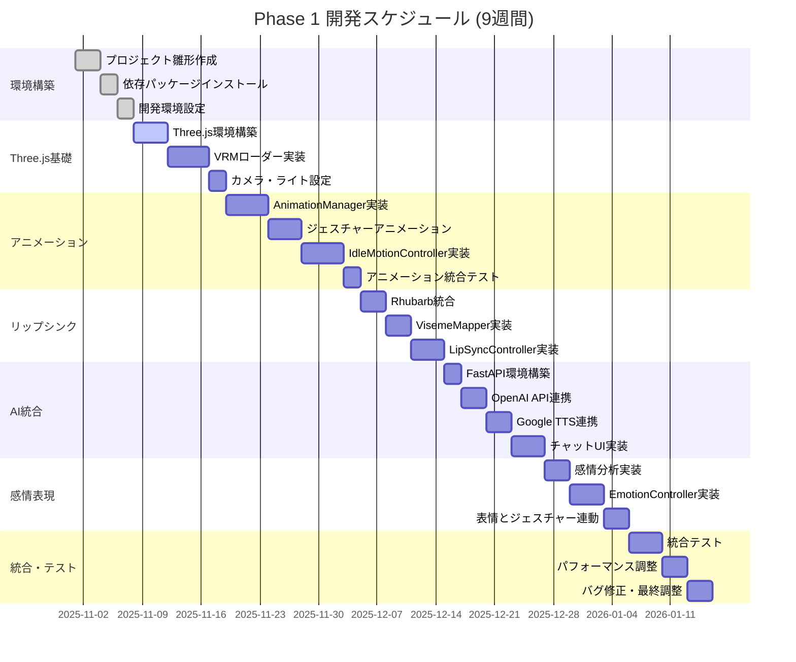
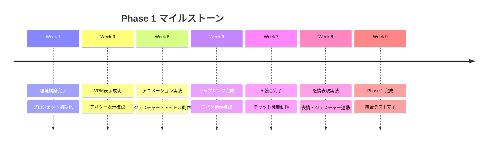

# 12. 開発スケジュール

[[11-ファイル構成|← 前へ]] | [[00-INDEX|目次]] | [[13-テスト要件|次へ →]]

---

## 12.1 開発期間

**Phase 1: 9週間**

## 12.2 ガントチャート

## 12.3 マイルストーン

## 12.4 週次タスク

| 週 | タスク | 成果物 | 関連ページ |
|----|--------|--------|-----------|
| 1 | 環境構築・基本設定 | プロジェクト雛形 | [[03-技術スタック\|技術スタック]] |
| 2-3 | Three.js + VRM表示 | アバター表示 | [[04-アバター表示機能\|アバター表示]] |
| 4-5 | アニメーションシステム | ジェスチャー・アイドル | [[05-アニメーション機能\|アニメーション]] |
| 6 | リップシンク実装 | 口パク動作 | [[05-アニメーション機能#リップシンク\|リップシンク]] |
| 7 | AI統合 | チャット機能 | [[06-AI対話機能\|AI対話]] |
| 8 | 感情表現・表情制御 | 表情変化 | [[05-アニメーション機能#表情制御\|表情制御]] |
| 9 | 統合テスト・調整 | Phase 1 完成 | [[13-テスト要件\|テスト要件]] |

## 12.5 関連ドキュメント

- [[01-プロジェクト概要|プロジェクト概要]]
- [[13-テスト要件|テスト要件]]
- [[15-今後の拡張|今後の拡張]]

---

**タグ**: #スケジュール #開発計画 #マイルストーン
**更新日**: 2025-10-30
