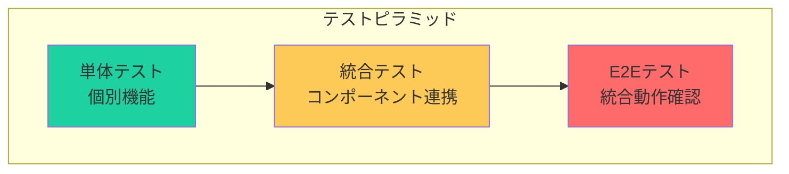
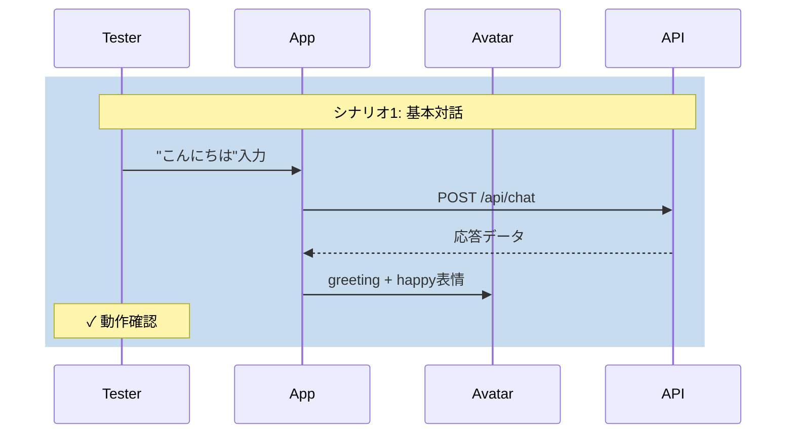

# 13. テスト要件

[[12-開発スケジュール|← 前へ]] | [[00-INDEX|目次]] | [[14-デプロイメント|次へ →]]

---

## 13.1 テスト戦略



## 13.2 単体テスト

### テスト対象

**フロントエンド:**
- AnimationManager
- LipSyncController
- EmotionController
- IdleMotionController
- API通信ユーティリティ

**バックエンド:**
- OpenAI Service
- TTS Service
- LipSync Service
- APIエンドポイント

### 実装例

```typescript
// AnimationManager.test.ts
import { describe, it, expect } from 'vitest';
import { AnimationManager } from './AnimationManager';

describe('AnimationManager', () => {
  it('should play animation with correct priority', () => {
    const manager = new AnimationManager();
    const animation = createTestAnimation();
    
    manager.playAnimation(animation, AnimationPriority.GESTURE);
    
    expect(manager.getCurrentAnimation(AnimationPriority.GESTURE))
      .toBe(animation);
  });
});
```

## 13.3 統合テスト

### テストシナリオ



## 13.4 パフォーマンステスト

### テスト項目

| 項目 | 目標値 | 測定方法 |
|------|--------|---------|
| 初期ロード | < 3秒 | Lighthouse |
| AI応答 | < 5秒 | API計測 |
| FPS | >= 30 | Chrome DevTools |
| メモリ | < 500MB | Task Manager |

関連: [[08-非機能要件#パフォーマンス要件|非機能要件]]

## 13.5 ブラウザテスト

### 対象ブラウザ

- Chrome 100+
- Firefox 100+
- Safari 15+
- Edge 100+

関連: [[08-非機能要件#互換性|非機能要件]]

## 13.6 関連ドキュメント

- [[08-非機能要件|非機能要件]]
- [[12-開発スケジュール|開発スケジュール]]

---

**タグ**: #テスト #品質保証 #パフォーマンス
**更新日**: 2025-10-30
