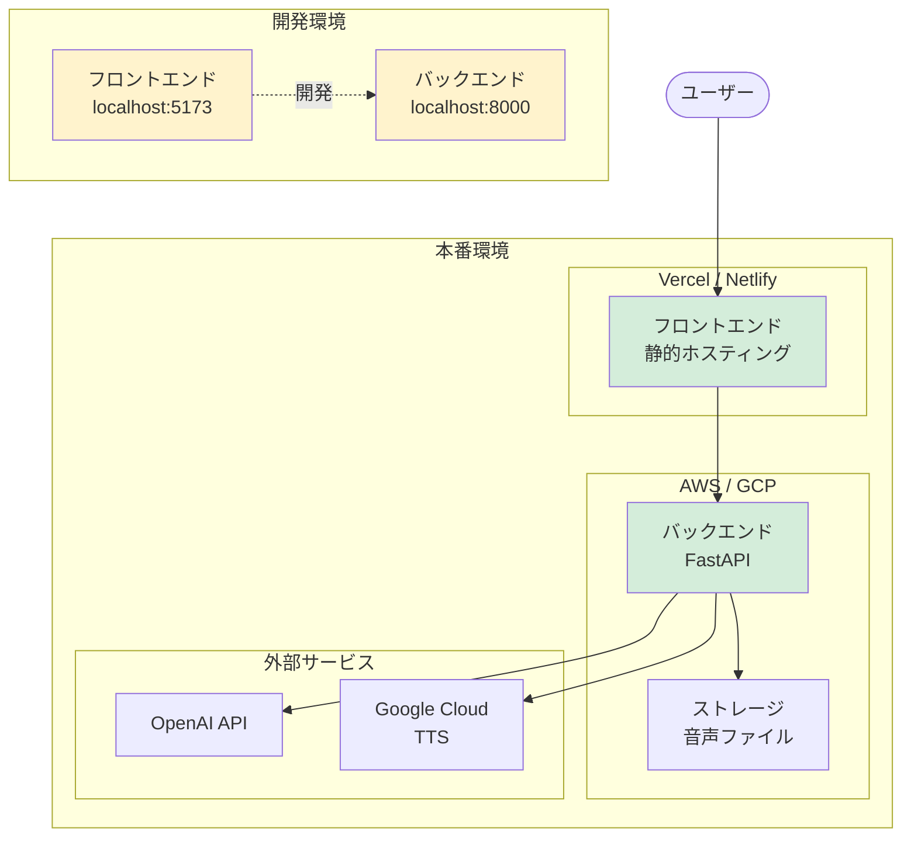
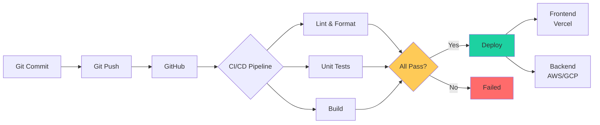

# 14. デプロイメント

[[13-テスト要件|← 前へ]] | [[00-INDEX|目次]] | [[15-今後の拡張|次へ →]]

---

## 14.1 デプロイ構成



## 14.2 CI/CDパイプライン



## 14.3 環境別設定

### 開発環境

```bash
# frontend/.env.development
VITE_API_URL=http://localhost:8000

# backend/.env.development
ENV=development
DEBUG=true
```

### 本番環境

```bash
# frontend/.env.production
VITE_API_URL=https://api.yourdomain.com

# backend/.env.production
ENV=production
DEBUG=false
```

## 14.4 関連ドキュメント

- [[02-システム構成|システム構成]]
- [[08-非機能要件|非機能要件]]

---

**タグ**: #デプロイ #インフラ #CI/CD
**更新日**: 2025-10-30
