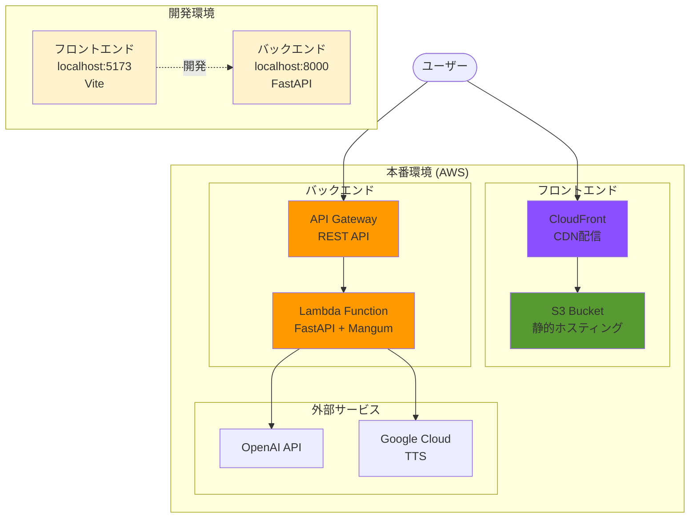
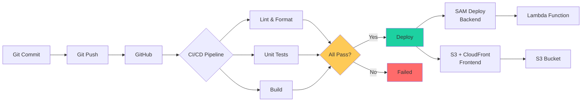

# 14. デプロイメント

[[13-テスト要件|← 前へ]] | [[00-INDEX|目次]] | [[15-今後の拡張|次へ →]]

---

## 14.1 デプロイ構成


```mermaid
graph TB
    subgraph "開発環境"
        DevFE[フロントエンド<br/>localhost:5173<br/>Vite]
        DevBE[バックエンド<br/>localhost:8000<br/>FastAPI]
    end

    subgraph "本番環境 (AWS)"
        subgraph "フロントエンド"
            S3[S3 Bucket<br/>静的ホスティング]
            CF[CloudFront<br/>CDN配信]
        end

        subgraph "バックエンド"
            APIGW[API Gateway<br/>REST API]
            Lambda[Lambda Function<br/>FastAPI + Mangum]
        end

        subgraph "外部サービス"
            OpenAI[OpenAI API]
            GCS[Google Cloud<br/>TTS]
        end
    end

    User([ユーザー]) --> CF
    CF --> S3
    User --> APIGW
    APIGW --> Lambda
    Lambda --> OpenAI
    Lambda --> GCS

    DevFE -.開発.-> DevBE

    style DevFE fill:#fff3cd
    style DevBE fill:#fff3cd
    style S3 fill:#569A31
    style CF fill:#8C4FFF
    style APIGW fill:#FF9900
    style Lambda fill:#FF9900
```

## 14.2 CI/CDパイプライン


```mermaid
graph LR
    Commit[Git Commit] --> Push[Git Push]
    Push --> GH[GitHub]
    
    GH --> CI{CI/CD Pipeline}
    
    CI --> Lint[Lint & Format]
    CI --> Test[Unit Tests]
    CI --> Build[Build]
    
    Lint --> Check{All Pass?}
    Test --> Check
    Build --> Check
    
    Check -->|Yes| Deploy[Deploy]
    Check -->|No| Fail[Failed]

    Deploy --> SAMDeploy[SAM Deploy<br/>Backend]
    Deploy --> S3Deploy[S3 + CloudFront<br/>Frontend]

    SAMDeploy --> Lambda[Lambda Function]
    S3Deploy --> S3[S3 Bucket]
    
    style Check fill:#feca57
    style Deploy fill:#1dd1a1
    style Fail fill:#ff6b6b
```

## 14.3 環境別設定

### 開発環境

```bash
# frontend/.env.development
VITE_API_URL=http://localhost:8000

# backend/.env
OPENAI_API_KEY=sk-...
OPENAI_MODEL=gpt-4
GOOGLE_APPLICATION_CREDENTIALS=./service-account.json
ENVIRONMENT=development
DEBUG=true
```

### 本番環境

```bash
# frontend/.env.production
VITE_API_URL=https://YOUR_API_GATEWAY_ID.execute-api.ap-northeast-1.amazonaws.com/prod

# AWS Systems Manager Parameter Store (推奨)
/ai-avatar/prod/openai-api-key
/ai-avatar/prod/google-credentials

# または Lambda環境変数
OPENAI_API_KEY=sk-...
ENVIRONMENT=production
DEBUG=false
```

## 14.4 デプロイ手順

### バックエンド (AWS SAM)

```bash
cd infrastructure

# 初回デプロイ（ガイド付き）
sam build
sam deploy --guided
# Stack Name: ai-avatar-dev
# Region: ap-northeast-1
# Parameter OpenAIApiKey: sk-...

# 2回目以降
sam build && sam deploy

# 本番環境デプロイ
sam deploy --config-env prod
```

### フロントエンド (S3 + CloudFront)

```bash
cd frontend

# ビルド
npm run build

# S3アップロード
aws s3 sync dist/ s3://YOUR_BUCKET_NAME/ --delete

# CloudFrontキャッシュ削除
aws cloudfront create-invalidation \
  --distribution-id YOUR_DISTRIBUTION_ID \
  --paths "/*"
```

## 14.5 ローカル開発環境

### オプション1: FastAPI直接実行 (推奨)

```bash
# Backend
cd backend
python local_server.py  # → http://localhost:8000

# Frontend
cd frontend
npm run dev  # → http://localhost:5173
```

**利点:**
- 高速なホットリロード
- デバッグが容易
- IDE統合良好

### オプション2: SAM CLI (Lambda環境テスト)

```bash
cd infrastructure

# Lambda環境でテスト
sam local start-api
# → http://localhost:3000

# 特定の関数を直接実行
sam local invoke BackendFunction --event events/chat.json
```

**利点:**
- Lambda環境に近い
- 本番環境との差異が少ない

## 14.6 モニタリング

### CloudWatch Logs

```bash
# Lambda関数のログ確認
aws logs tail /aws/lambda/ai-avatar-backend --follow

# エラーログのみ表示
aws logs filter-pattern --log-group-name /aws/lambda/ai-avatar-backend \
  --filter-pattern "ERROR"
```

### CloudWatch Metrics

監視項目:
- Lambda実行時間
- Lambda エラー率
- API Gateway リクエスト数
- CloudFront キャッシュヒット率

## 14.7 関連ドキュメント

- [[02-システム構成|システム構成]]
- [[03-技術スタック|技術スタック]]
- [[08-非機能要件|非機能要件]]
- [[16-SAM移行計画|SAM移行計画]]

---

**タグ**: #デプロイ #インフラ #CI/CD #AWS #SAM #Lambda
**更新日**: 2025-11-08
**変更履歴**: AWS SAM構成に全面更新
