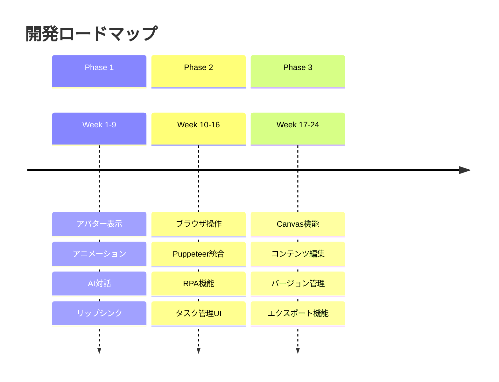
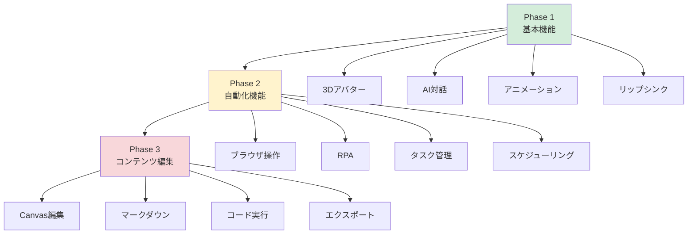

# 15. 今後の拡張

[[14-デプロイメント|← 前へ]] | [[00-INDEX|目次]] | [[16-用語集|次へ →]]

---

## 15.1 Phase 2-3 ロードマップ

## 15.2 Phase 2 計画

### ブラウザ操作機能

**追加機能:**
- Puppeteer統合
- 自動予約操作
- 自動検索操作
- スクリーンショット取得

**技術:**
- Puppeteer / Playwright
- タスクキュー管理

### RPA機能

**追加機能:**
- 定型業務自動化
- スケジューリング
- 実行ログ記録

## 15.3 Phase 3 計画

### Canvas機能

**追加機能:**
- リアルタイム編集
- Markdown対応
- コード実行
- エクスポート機能

**参考:**
Geminiの「Canvas」機能

## 15.4 機能拡張マップ

## 15.5 関連ドキュメント

- [[01-プロジェクト概要|プロジェクト概要]]
- [[12-開発スケジュール|開発スケジュール]]

---

**タグ**: #拡張計画 #Phase2 #Phase3 #ロードマップ
**更新日**: 2025-10-30
