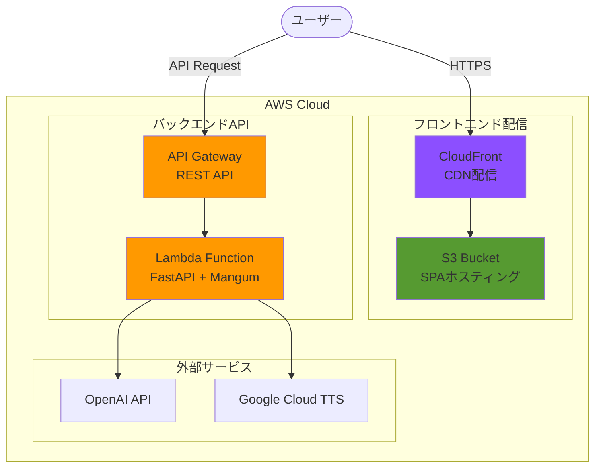

# 16. AWS SAM移行計画

[[15-今後の拡張|← 前へ]] | [[00-INDEX|目次]]

---

## 16.1 移行概要

### 移行の目的

TerraformからAWS SAM (Serverless Application Model) への移行により、以下のメリットを実現します:

```
✓ サーバーレス開発の簡素化
✓ ローカル開発環境の統一
✓ デプロイプロセスの簡素化
✓ Lambda関数とAPI Gatewayの統合管理
✓ AWS特化による最適化
```

### 移行対象

```
- インフラ管理: Terraform → AWS SAM
- バックエンド構成: Lambda関数の追加
- ローカル開発: SAM CLI活用
- デプロイ: sam deploy による一元管理
```

## 16.2 新しいアーキテクチャ

### システム構成図



### コンポーネント詳細

| コンポーネント | 役割 | 技術 |
|---------------|------|------|
| **S3** | 静的ファイルホスティング | Viteビルド成果物 (HTML/JS/CSS) |
| **CloudFront** | グローバル配信 + HTTPS | CDN、カスタムドメイン対応 |
| **API Gateway** | APIエンドポイント | REST API、CORS設定 |
| **Lambda** | バックエンド処理 | Python 3.12+, FastAPI, Mangum |

## 16.3 ディレクトリ構造

### 新しいプロジェクト構造

```
ai-avater/
├── frontend/                    # React SPA (変更なし)
│   ├── src/
│   ├── public/
│   └── package.json
│
├── backend/                     # Lambda Functions (新規実装)
│   ├── app/
│   │   ├── main.py             # FastAPI + Mangum エントリポイント
│   │   ├── routers/
│   │   │   ├── chat.py         # POST /api/chat
│   │   │   └── health.py       # GET /api/health
│   │   ├── services/
│   │   │   ├── ai_service.py   # OpenAI連携
│   │   │   ├── tts_service.py  # Google TTS連携
│   │   │   └── lipsync_service.py  # Rhubarb連携
│   │   └── models/
│   │       └── schemas.py      # Pydantic models
│   ├── requirements.txt
│   ├── local_server.py         # ローカル開発用サーバー
│   └── README.md
│
├── infrastructure/              # AWS SAM (新規)
│   ├── template.yaml           # SAM テンプレート
│   ├── samconfig.toml          # SAM 設定
│   └── scripts/
│       ├── deploy.sh           # デプロイスクリプト
│       └── local-invoke.sh     # ローカルテストスクリプト
│
├── .github/
│   └── workflows/
│       └── deploy.yml          # GitHub Actions
│
└── document/
    └── 16-SAM移行計画.md       # このファイル
```

### 削除されるファイル

```
infrastructure/terraform/       # Terraform関連ファイルはすべて削除
├── main.tf
├── variables.tf
├── s3.tf
├── cloudfront.tf
├── iam.tf
├── outputs.tf
└── terraform.tfvars.example
```

## 16.4 SAMテンプレート設計

### template.yaml 概要

```yaml
AWSTemplateFormatVersion: '2010-09-09'
Transform: AWS::Serverless-2016-10-31

Parameters:
  Environment:
    Type: String
    Default: dev
    AllowedValues: [dev, prod]

  OpenAIApiKey:
    Type: String
    NoEcho: true

Resources:
  # S3 Bucket - フロントエンド
  FrontendBucket:
    Type: AWS::S3::Bucket
    Properties:
      WebsiteConfiguration:
        IndexDocument: index.html

  # CloudFront Distribution
  FrontendDistribution:
    Type: AWS::CloudFront::Distribution
    Properties:
      DistributionConfig:
        DefaultCacheBehavior:
          TargetOriginId: S3Origin
          ViewerProtocolPolicy: redirect-to-https

  # API Gateway + Lambda
  ApiGateway:
    Type: AWS::Serverless::Api
    Properties:
      StageName: !Ref Environment
      Cors:
        AllowOrigin: "'*'"

  # Lambda Function
  BackendFunction:
    Type: AWS::Serverless::Function
    Properties:
      Runtime: python3.12
      Handler: app.main.handler
      CodeUri: ../backend/
      Environment:
        Variables:
          OPENAI_API_KEY: !Ref OpenAIApiKey
          ENVIRONMENT: !Ref Environment
      Events:
        ApiEvent:
          Type: Api
          Properties:
            RestApiId: !Ref ApiGateway
            Path: /api/{proxy+}
            Method: ANY

Outputs:
  FrontendUrl:
    Value: !GetAtt FrontendDistribution.DomainName
  ApiUrl:
    Value: !Sub "https://${ApiGateway}.execute-api.${AWS::Region}.amazonaws.com/${Environment}/"
```

詳細なテンプレートは実装時に作成します。

## 16.5 FastAPI + Mangum 実装

### エントリポイント (backend/app/main.py)

```python
from fastapi import FastAPI
from fastapi.middleware.cors import CORSMiddleware
from mangum import Mangum

from app.routers import chat, health

app = FastAPI(title="AI Avatar API")

# CORS設定
app.add_middleware(
    CORSMiddleware,
    allow_origins=["*"],  # 本番では制限推奨
    allow_methods=["*"],
    allow_headers=["*"],
)

# ルーター登録
app.include_router(health.router, prefix="/api")
app.include_router(chat.router, prefix="/api")

# Lambda用ハンドラー
handler = Mangum(app, lifespan="off")

# ローカル開発用
if __name__ == "__main__":
    import uvicorn
    uvicorn.run(app, host="0.0.0.0", port=8000)
```

### ローカル開発用サーバー (backend/local_server.py)

```python
"""
ローカル開発用FastAPIサーバー

SAM CLIを使わずにローカルでAPIサーバーを起動:
  python local_server.py

利点:
- 高速なリロード (--reload)
- デバッグが容易
- 環境変数は .env から読み込み
"""
import uvicorn
from app.main import app
from dotenv import load_dotenv

load_dotenv()

if __name__ == "__main__":
    uvicorn.run(
        "app.main:app",
        host="0.0.0.0",
        port=8000,
        reload=True,  # コード変更時に自動リロード
    )
```

## 16.6 ローカル開発環境

### 開発方法の選択肢

#### オプション1: FastAPI直接実行 (推奨: 開発時)

```bash
cd backend

# 仮想環境作成
python -m venv venv
source venv/bin/activate  # Windows: venv\Scripts\activate

# 依存関係インストール
pip install -r requirements.txt

# .env ファイル作成
cat > .env <<EOF
OPENAI_API_KEY=sk-...
GOOGLE_APPLICATION_CREDENTIALS=path/to/service-account.json
ENVIRONMENT=development
EOF

# ローカルサーバー起動 (ホットリロード有効)
python local_server.py
# → http://localhost:8000
# → http://localhost:8000/docs (Swagger UI)
```

**利点:**
- 高速な起動・リロード
- デバッグが容易
- IDEとの統合が良好

#### オプション2: SAM CLI (推奨: 本番環境テスト時)

```bash
cd infrastructure

# SAM CLIインストール (初回のみ)
# https://docs.aws.amazon.com/serverless-application-model/latest/developerguide/install-sam-cli.html

# Lambda環境でテスト
sam local start-api --env-vars env.json
# → http://localhost:3000

# 特定の関数を直接実行
sam local invoke BackendFunction --event events/chat.json
```

**利点:**
- Lambda環境に近い
- API Gateway統合テスト
- 本番環境との差異が少ない

### フロントエンド + バックエンド同時開発

```bash
# ターミナル1: バックエンド
cd backend
python local_server.py

# ターミナル2: フロントエンド
cd frontend
npm run dev

# フロントエンドから http://localhost:8000 にアクセス
```

## 16.7 デプロイ手順

### 初回デプロイ

```bash
cd infrastructure

# SAM初期化 (初回のみ)
sam build

# ガイド付きデプロイ
sam deploy --guided
# 対話形式で以下を入力:
#   - Stack Name: ai-avatar-dev
#   - Region: ap-northeast-1
#   - Parameter OpenAIApiKey: sk-...
#   - Confirm changes before deploy: Y
#   - Allow SAM CLI IAM role creation: Y
#   - Save arguments to configuration file: Y
```

設定は `samconfig.toml` に保存されます。

### 2回目以降のデプロイ

```bash
cd infrastructure

# ビルド
sam build

# デプロイ (設定済みパラメータ使用)
sam deploy

# または環境指定
sam deploy --config-env prod
```

### フロントエンドのデプロイ

```bash
cd frontend

# ビルド
npm run build

# S3にアップロード
aws s3 sync dist/ s3://your-frontend-bucket/ --delete

# CloudFrontキャッシュ削除
aws cloudfront create-invalidation \
  --distribution-id YOUR_DISTRIBUTION_ID \
  --paths "/*"
```

## 16.8 環境変数管理

### backend/.env (ローカル開発)

```bash
# OpenAI
OPENAI_API_KEY=sk-...
OPENAI_MODEL=gpt-4

# Google Cloud
GOOGLE_APPLICATION_CREDENTIALS=./service-account.json

# 環境
ENVIRONMENT=development
DEBUG=true
```

### SAM Parameters (本番環境)

```bash
# AWS Systems Manager Parameter Store 推奨
aws ssm put-parameter \
  --name /ai-avatar/prod/openai-api-key \
  --value "sk-..." \
  --type SecureString

# template.yaml で参照
Parameters:
  OpenAIApiKey:
    Type: AWS::SSM::Parameter::Value<String>
    Default: /ai-avatar/prod/openai-api-key
```

## 16.9 CI/CDパイプライン

### GitHub Actions (.github/workflows/deploy.yml)

```yaml
name: Deploy to AWS

on:
  push:
    branches: [main, dev]

jobs:
  deploy-backend:
    runs-on: ubuntu-latest
    steps:
      - uses: actions/checkout@v3

      - name: Setup Python
        uses: actions/setup-python@v4
        with:
          python-version: '3.12'

      - name: Setup SAM
        uses: aws-actions/setup-sam@v2

      - name: Configure AWS credentials
        uses: aws-actions/configure-aws-credentials@v2
        with:
          aws-access-key-id: ${{ secrets.AWS_ACCESS_KEY_ID }}
          aws-secret-access-key: ${{ secrets.AWS_SECRET_ACCESS_KEY }}
          aws-region: ap-northeast-1

      - name: SAM Build & Deploy
        run: |
          cd infrastructure
          sam build
          sam deploy --no-confirm-changeset --no-fail-on-empty-changeset

  deploy-frontend:
    runs-on: ubuntu-latest
    needs: deploy-backend
    steps:
      - uses: actions/checkout@v3

      - name: Setup Node
        uses: actions/setup-node@v3
        with:
          node-version: '20'

      - name: Build Frontend
        run: |
          cd frontend
          npm ci
          npm run build

      - name: Deploy to S3
        run: |
          aws s3 sync frontend/dist/ s3://${{ secrets.FRONTEND_BUCKET }}/ --delete

      - name: Invalidate CloudFront
        run: |
          aws cloudfront create-invalidation \
            --distribution-id ${{ secrets.CLOUDFRONT_DISTRIBUTION_ID }} \
            --paths "/*"
```

## 16.10 移行手順

### ステップ1: バックエンド実装

```bash
# 1. FastAPI + Mangum実装
cd backend
# app/main.py, routers/, services/ を実装

# 2. ローカルテスト
python local_server.py
# → http://localhost:8000/docs で動作確認
```

### ステップ2: SAMテンプレート作成

```bash
# 1. infrastructure/template.yaml 作成
cd infrastructure

# 2. ローカルテスト
sam local start-api

# 3. 動作確認
curl http://localhost:3000/api/health
```

### ステップ3: Terraform削除 & SAMデプロイ

```bash
# 1. Terraformリソース削除 (既存がある場合)
cd infrastructure/terraform
terraform destroy

# 2. SAM デプロイ
cd ../
sam build
sam deploy --guided
```

### ステップ4: フロントエンド設定変更

```bash
# 1. .env.production 更新
cd frontend
echo "VITE_API_URL=https://your-api-gateway-url.execute-api.ap-northeast-1.amazonaws.com/dev" > .env.production

# 2. ビルド & デプロイ
npm run build
aws s3 sync dist/ s3://your-bucket/
```

### ステップ5: 動作確認

```bash
# E2Eテスト実行
curl https://your-cloudfront-url.cloudfront.net
curl https://your-api-url/api/health
```

## 16.11 コスト比較

### Terraform構成 (EC2/ECS想定)

```
概算月額コスト:
- EC2 t3.small (24時間): $15-20
- ALB: $20-25
- データ転送: $10-50
合計: $45-95/月
```

### SAM構成 (サーバーレス)

```
概算月額コスト:
- Lambda実行: $0-5 (月100万リクエスト想定)
- API Gateway: $3.50 (月100万リクエスト)
- S3 + CloudFront: $1-10
- データ転送: $5-20
合計: $10-40/月

無料枠内であれば $0-5/月も可能
```

**コスト削減効果: 50-80%**

## 16.12 メリット・デメリット

### メリット

```
✓ サーバーレスによるコスト削減
✓ 自動スケーリング (トラフィック対応)
✓ ローカル開発環境の統合
✓ デプロイが簡単 (sam deploy のみ)
✓ AWS特化による最適化
✓ Lambda + API Gateway の統合管理
✓ インフラコードの簡素化
```

### デメリット

```
✗ Lambda実行時間制限 (最大15分)
  → 対策: 音声生成は非同期処理推奨
✗ コールドスタート (初回レスポンス遅延)
  → 対策: Provisioned Concurrency (有料)
✗ AWS依存度が高い
  → 影響: マルチクラウド不可
```

## 16.13 技術スタック更新

### 新しい技術スタック

| カテゴリ | 旧 | 新 |
|---------|----|----|
| **インフラ管理** | Terraform | AWS SAM |
| **バックエンド** | FastAPI | FastAPI + Mangum |
| **ランタイム** | 未定 | AWS Lambda (Python 3.12) |
| **API** | 未定 | API Gateway |
| **ローカル開発** | Uvicorn | Uvicorn + SAM CLI |

## 16.14 関連ドキュメント

- [[02-システム構成]] - 更新が必要
- [[03-技術スタック]] - 更新が必要
- [[10-API仕様]] - 変更なし
- [[14-デプロイメント]] - 大幅更新が必要

## 16.15 次のステップ

### 実装順序

1. **Week 1-2: バックエンド実装**
   - FastAPI + Mangum基盤構築
   - ローカル開発環境構築
   - API実装 (health, chat)

2. **Week 3: SAMテンプレート作成**
   - template.yaml 作成
   - ローカルテスト (sam local)
   - 環境変数管理

3. **Week 4: デプロイ & 統合**
   - SAM デプロイ (dev環境)
   - フロントエンド連携
   - E2Eテスト

4. **Week 5: CI/CD & 本番化**
   - GitHub Actions設定
   - 本番環境デプロイ
   - モニタリング設定

---

**タグ**: #SAM #サーバーレス #AWS #Lambda #移行計画
**更新日**: 2025-11-08
**ステータス**: 設計完了・実装待ち
